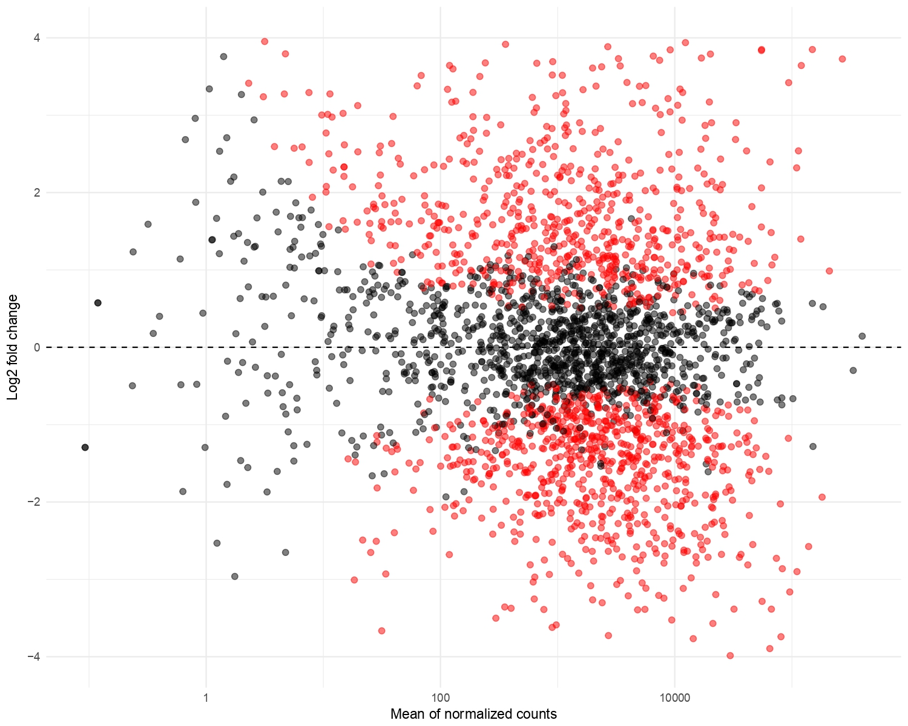
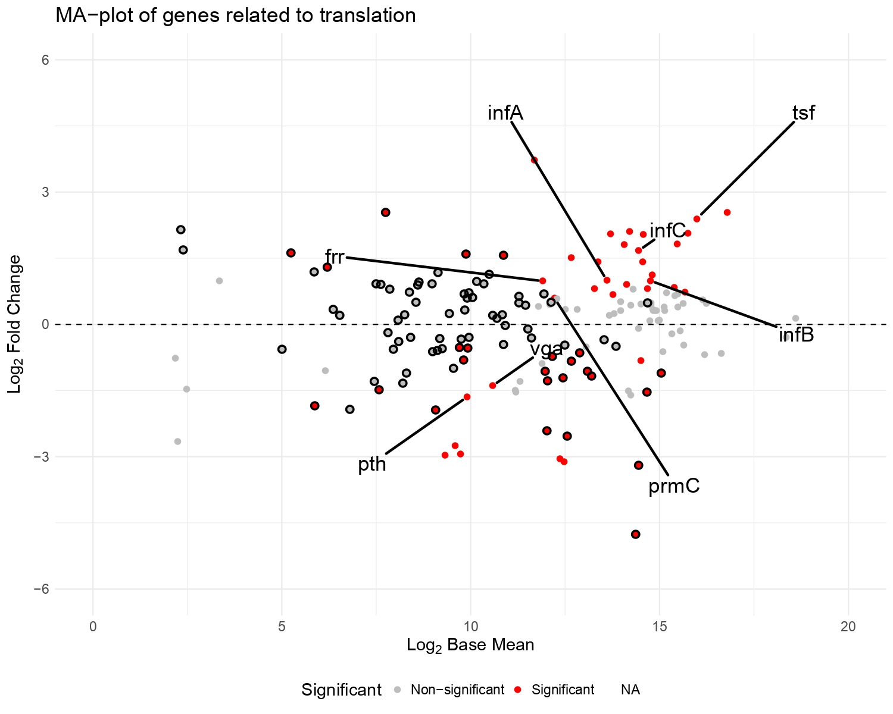

# Hackaton reproductibilité

Ce projet est réalisé dans le cadre d'une Unité d'enseignement du Master 2 AMI2B de l'université de Paris-Saclay : ANALYSE, MODÉLISATION ET INGÉNIERIE DE L'INFORMATION BIOLOGIQUE ET MÉDICALE

## But du projet

Ce projet vise à reproduire certains résultats issus de [cet article](https://www.nature.com/articles/s41467-020-15966-7). 
Les résultats à reproduire sont une analyse d'expression différentielle de *S. aureus* dans 2 conditions de stress différentes.

Pour cela nous allons utiliser des outils de bio-informatique pour l'analyse de donnée de séquençage à haut-débit en tentant de rendre tout cela \ 
le plus reproductible possible avec l'utilisation du framework [Nextflow](https://nextflow.io/) et [Docker](docker.com).

## Configuration utilisée pour l'analyse / Pré-requis

Il est nécessaire d'avoir une version stable de `Nextflow`, dans notre cas nous avons utilisé la version `24.10.2`. 

Il est également nécessaire d'avoir `Docker`, la version que nous avons utilisé est la `27.3.1` mais toute version permettant l'utilisation de Dockerhub est suffisante.

Ensuite il faut activer l'environnement avec `Nextflow` et `Docker`, ici nous utilisons un environnement appelé `nextflow` contenant ces deux outils :
```sh 
conda activate nextflow
```

Une installation en local de nextflow et docker est également possible mais l'utilisation de `conda` reste la plus simple et efficace. ([ Référence d'installation nextflow](https://anaconda.org/bioconda/nextflow))

## Utilisation du workflow

Pour utiliser le workflow il est suffit de copier le repertoire en local :

```sh
git clone https://github.com/Tikings/reprohackaton.git
cd reprohackaton
```

Lancer l'envrionnement conda contenant `nextflow` et `docker`, et lancer la commande : 
```sh
nextflow run -c Nextflow/nextflow.config Nextflow/process.nf
```

En cas d'arrêt au cours de l'execution du workflow, il est possible de relancer le process avec la commande :
```sh
nextflow run -c Nextflow/nextflow.config Nextflow/process.nf -resume
```

## Sorties du workflow

Une fois le workflow terminé, on se retrouve avec 2 nouveaux dossier : 
- `./results` : Un dossier contenant Les figures produites par le script R ainsi de le fichier de comptage issue du prétraitement des données
- `./reports` : Une dossier contenant un rapport des processus du workflow (durée de chaque processus, utilisation de la mémoire)

Les images produites sont les suivantes : 
- Image 1 prenant en compte tous les gènes : 


Qui est associée à cette figure dans le papier : 


- Image 2 prenant en compte les gènes associés aux pathways associés à la traduction : 

associé à cette figure dans le papier :


____

## Rapport

Le rapport détaillé de la mise en place du workflow est contenu dans le rapport disponible ici et une explication détaillée du workflow est donnée dans le [ wiki ](https://github.com/Tikings/reprohackaton/wiki)

