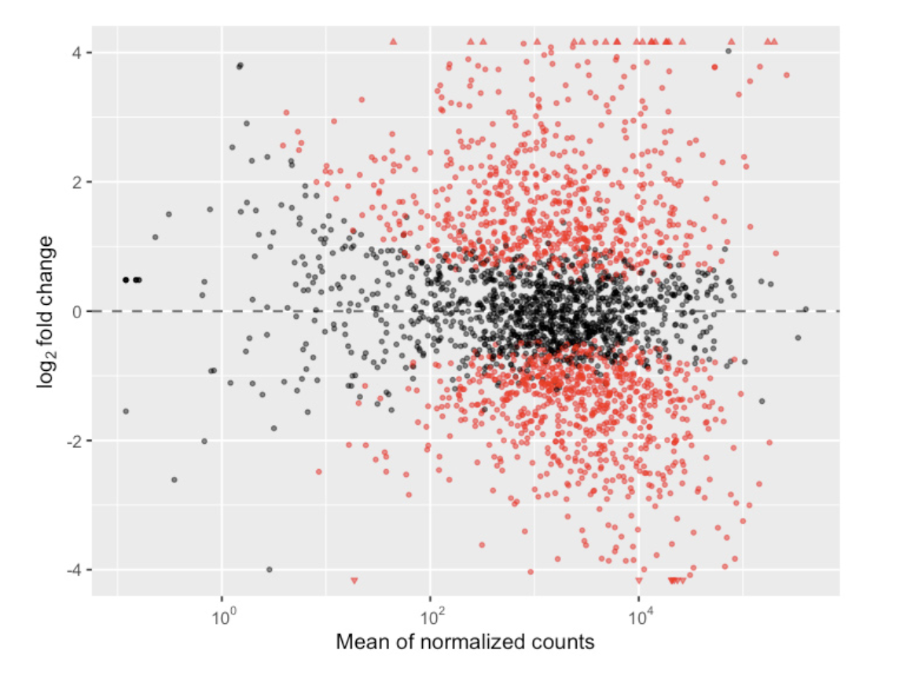

# Hackaton reproductibilité

Nous allons travailler à reproduire les données de cet  [article](https://www.nature.com/articles/s41467-020-15966-7)

L'objectif est de reproduire les figures suivantes : 

Pour cela nous utiliserons Nextflow et Docker pour développer le pipeline. 
La méthode d'analyse statistique est la suivante : [ Differential expression ](https://en.wikipedia.org/wiki/RNA-Seq#Differential_expression)

